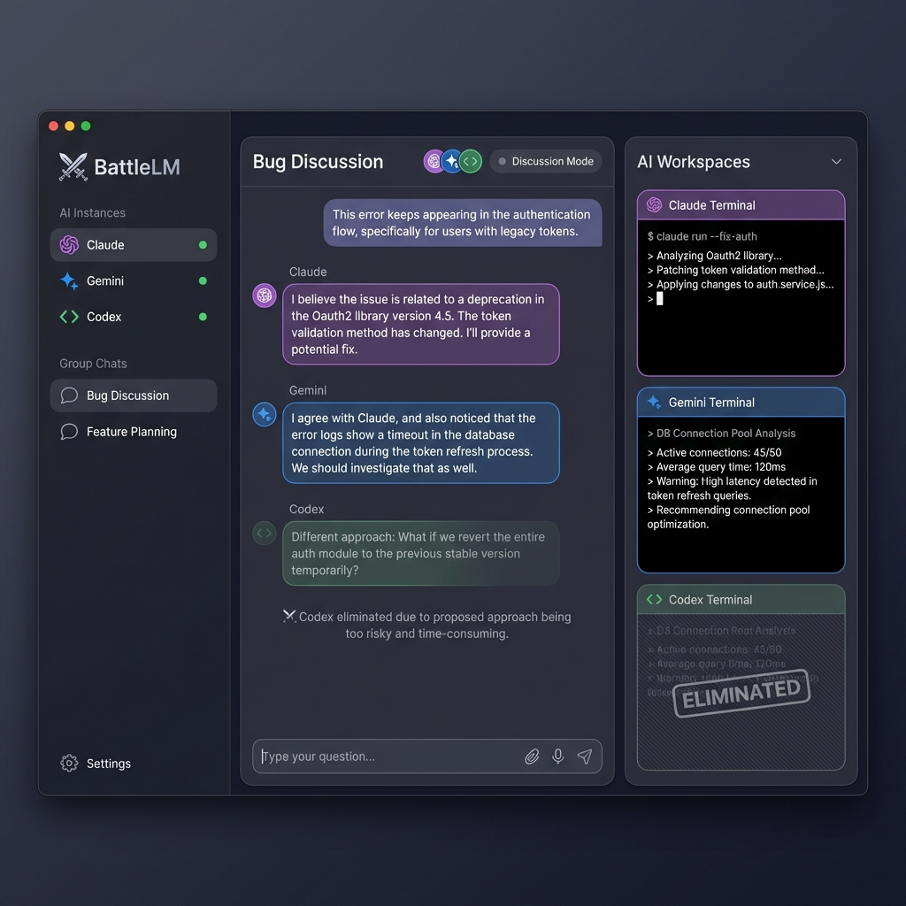

# BattleLM - 产品设计文档 v2

## 1. 产品概述

**BattleLM** 是一个 macOS 原生应用，让用户可以同时运行多个 AI CLI（如 Claude、Gemini、Codex），并让它们在"群聊"中协作讨论问题、相互评价、最终给出解决方案。

### 核心价值
- 🧠 **多 AI 协作**：减少单一 AI 的盲点
- 🔒 **本地运行**：数据隐私有保障
- 👁️ **透明可见**：实时查看每个 AI 的工作过程
- ⚔️ **淘汰机制**：筛选高质量回答

---

## 2. 系统架构

### 2.1 整体架构

```
┌─────────────────────────────────────────────────────────────────────┐
│                         BattleLM.app                                 │
├─────────────────────────────────────────────────────────────────────┤
│  ┌───────────────────────────────────────────────────────────────┐  │
│  │                    用户界面层 (SwiftUI)                        │  │
│  │  ┌──────────┐ ┌────────────────────┐ ┌────────────────────┐   │  │
│  │  │ 侧边栏    │ │    群聊界面         │ │   AI 终端区域      │   │  │
│  │  │ AI 列表   │ │   (裁决看板)        │ │  (SwiftTerm)      │   │  │
│  │  │ 群聊列表  │ │   消息 + 状态       │ │  实时工作过程      │   │  │
│  │  └──────────┘ └────────────────────┘ └────────────────────┘   │  │
│  └───────────────────────────────────────────────────────────────┘  │
│                                │                                     │
│  ┌───────────────────────────────────────────────────────────────┐  │
│  │                    服务层 (自动后台运行)                        │  │
│  │  ┌──────────────┐ ┌──────────────┐ ┌──────────────┐           │  │
│  │  │ MessageRouter│ │ ModeController│ │ Elimination  │           │  │
│  │  │  消息路由     │ │  模式控制     │ │  Engine      │           │  │
│  │  └──────────────┘ └──────────────┘ └──────────────┘           │  │
│  └───────────────────────────────────────────────────────────────┘  │
│                                │                                     │
│  ┌───────────────────────────────────────────────────────────────┐  │
│  │                    进程层 (用户不可见)                          │  │
│  │  ┌──────────────┐ ┌──────────────┐ ┌──────────────┐           │  │
│  │  │ SessionMgr   │ │ bridge.py    │ │ monitor.py   │           │  │
│  │  │ (tmux 管理)  │ │ (复用现有)    │ │ (复用现有)    │           │  │
│  │  └──────────────┘ └──────────────┘ └──────────────┘           │  │
│  └───────────────────────────────────────────────────────────────┘  │
└─────────────────────────────────────────────────────────────────────┘
```

### 2.2 App 启动流程

```
用户双击 BattleLM.app
        ↓
┌─────────────────────────────────────┐
│ 1. 检查依赖 (tmux, AI CLIs)          │
│ 2. 自动启动后台服务                   │
│    - SessionManager                  │
│    - MessageRouter                   │
│ 3. 加载用户数据 (AI 实例, 群聊)        │
│ 4. 显示主界面                         │
└─────────────────────────────────────┘
        ↓
用户即可使用，无需手动运行任何脚本
```

---

## 3. UI 设计

### 3.1 UI 草图



### 3.2 界面布局

```
┌─────────────────────────────────────────────────────────────────────────┐
│ ● ○ ○                        BattleLM                                   │
├─────────┬───────────────────────────────────┬───────────────────────────┤
│         │                                    │                           │
│   AI    │         群聊界面                   │      AI 工作区            │
│ 实例    │        (裁决看板)                  │     (终端视图)            │
│         │                                    │                           │
│ ● Claude│  ┌─────────────────────────────┐  │  ┌─────────────────────┐  │
│ ● Gemini│  │ Bug Discussion  讨论模式     │  │  │ Claude Terminal     │  │
│ ● Codex │  │ ●●●                         │  │  │ $ claude            │  │
│         │  ├─────────────────────────────┤  │  │ ✦ Analyzing...      │  │
│─────────│  │                             │  │  └─────────────────────┘  │
│         │  │ 👤 This error keeps...      │  │  ┌─────────────────────┐  │
│  群聊   │  │                             │  │  │ Gemini Terminal     │  │
│         │  │ 🟣 Claude:                  │  │  │ $ gemini            │  │
│ ▸ Bug   │  │ I believe the issue...      │  │  │ ✦ Checking...       │  │
│   讨论  │  │                             │  │  └─────────────────────┘  │
│ ▸ 功能  │  │ 🔵 Gemini:                  │  │  ┌─────────────────────┐  │
│   规划  │  │ I agree with Claude...      │  │  │ Codex Terminal      │  │
│         │  │                             │  │  │ [ELIMINATED]        │  │
│─────────│  │ 🟢 Codex:                   │  │  └─────────────────────┘  │
│         │  │ Different approach...       │  │                           │
│ ⚙ 设置  │  │                             │  │  ┌─────────────────────┐  │
│         │  │ ⚔️ Codex eliminated         │  │  │ ▶ 展开/折叠          │  │
│         │  │                             │  │  └─────────────────────┘  │
│         │  ├─────────────────────────────┤  │                           │
│         │  │ 💬 Type your question...    │  │                           │
│         │  └─────────────────────────────┘  │                           │
└─────────┴───────────────────────────────────┴───────────────────────────┘
```

### 3.3 界面组件

#### A. 侧边栏 (左)

| 区域 | 功能 |
|------|------|
| **AI 实例** | 显示所有已添加的 AI，状态指示灯 |
| **群聊列表** | 显示所有群聊，点击切换 |
| **设置** | 应用配置入口 |

#### B. 群聊界面 (中)

| 区域 | 功能 |
|------|------|
| **顶栏** | 群聊名称 + 参与的 AI 头像 + 当前模式 |
| **消息区** | 显示所有消息（用户/AI/系统） |
| **输入框** | 用户输入问题 |

**消息类型样式：**
- 👤 用户消息：右对齐，紫色气泡
- 🤖 AI 消息：左对齐，带头像和颜色标识
- ⚔️ 系统消息：居中，淡灰色

#### C. AI 工作区 (右)

| 区域 | 功能 |
|------|------|
| **终端视图** | 每个 AI 一个 SwiftTerm 终端 |
| **状态指示** | 活跃/已淘汰 |
| **折叠控制** | 可折叠以获得更多群聊空间 |

---

## 4. 核心功能

### 4.1 AI 实例管理

- 添加 AI（选择类型：Claude/Gemini/Codex）
- 启动/停止 AI
- 查看 AI 状态

### 4.2 群聊功能

- 创建群聊（选择参与的 AI）
- 发送消息（自动广播给所有 AI）
- AI 互相可见消息

### 4.3 讨论模式

```
Round 1: 每个 AI 分析问题 (n 条)
Round 2: 每个 AI 评价其他 AI (n*(n-1) 条)
Round 3: 淘汰评价最差的 AI
Round 4: 剩余 AI 修正分析 (n-a 条)
```

### 4.4 解决方案模式

```
Round 1: 每个 AI 给出方案 (n-a 条)
Round 2: 每个 AI 评价其他方案
Round 3: 淘汰并选出最佳方案
```

### 4.5 淘汰算法

- AI 评价时输出分数 (0-10) + 理由
- 取均值排序
- 淘汰最低 30%

---

## 5. 数据模型

```swift
// AI 实例
struct AIInstance: Identifiable, Codable {
    let id: UUID
    let type: AIType          // .claude, .gemini, .codex
    var name: String
    var tmuxSession: String
    var isActive: Bool
    var isEliminated: Bool
}

// 群聊
struct GroupChat: Identifiable, Codable {
    let id: UUID
    var name: String
    var memberIds: [UUID]
    var messages: [Message]
    var mode: ChatMode
    var eliminatedIds: [UUID]
    var currentRound: Int
}

// 消息
struct Message: Identifiable, Codable {
    let id: UUID
    let senderId: UUID
    let senderType: SenderType   // .user, .ai, .system
    let senderName: String
    let content: String
    let timestamp: Date
    let messageType: MessageType // .question, .analysis, .evaluation, .solution
}
```

---

## 6. 技术选型

| 层 | 技术 | 说明 |
|----|------|------|
| UI | SwiftUI | 原生 macOS 界面 |
| 终端 | SwiftTerm | 内嵌 PTY 终端 |
| 会话 | tmux | 复用现有成熟方案 |
| 消息 | bridge.py / monitor.py | 复用 Telegram 项目代码 |
| 存储 | CoreData / SQLite | 本地持久化 |

---

## 7. App Store 兼容性

| 要求 | 方案 |
|------|------|
| 不能用 AppleScript | ✅ 使用 SwiftTerm 内嵌终端 |
| Sandbox 权限 | ✅ 仅需进程和网络权限 |
| 无外部依赖 | ✅ tmux 可作为可选依赖提示用户安装 |
